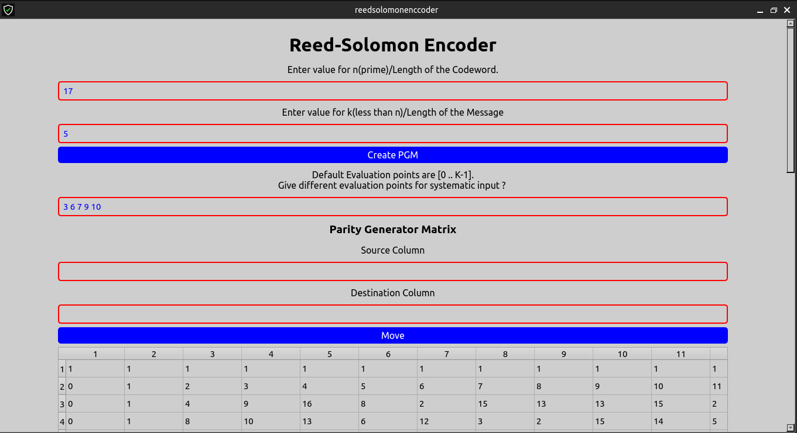
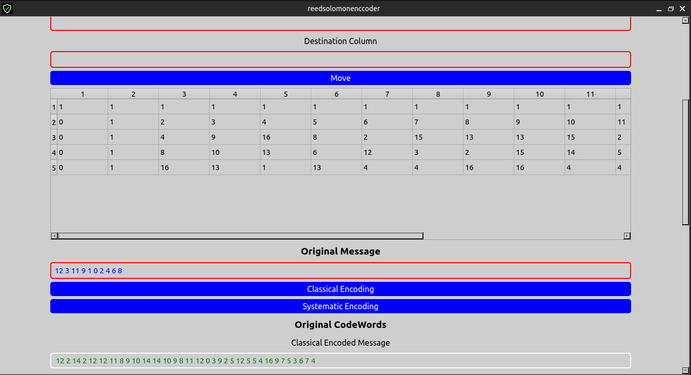
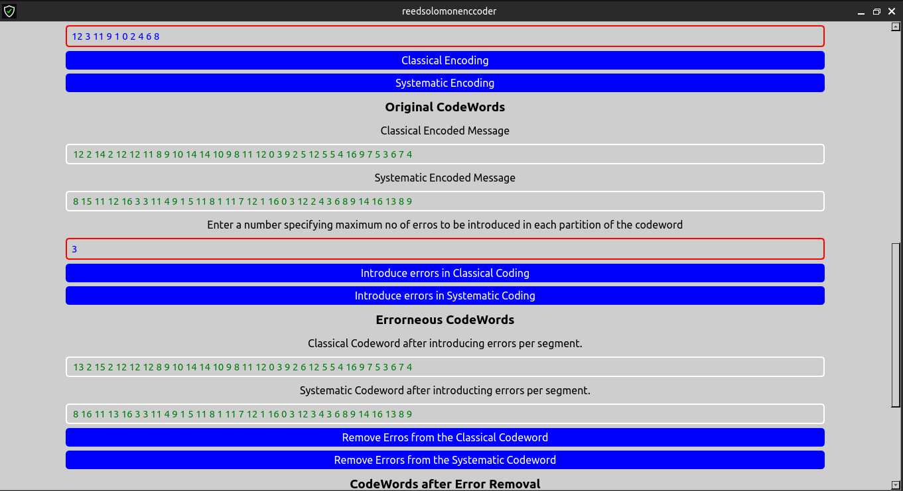
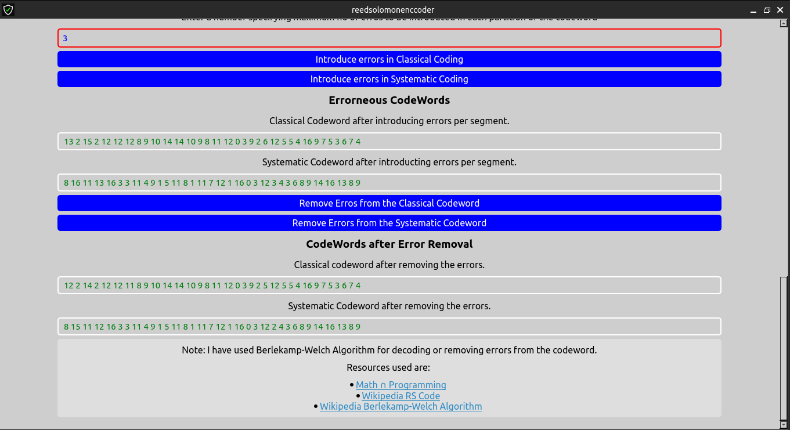

# Reed-Solomon-Code
This is my course project of CS425(Algebraic Coding Theory &amp; Cryptology) on Reed-Solomon Code. It covers both encoding and decoding.
# Reed-Solomon Encoding and Decoding Input Order

To use the Reed-Solomon encoding and decoding in this QT C++ application, please follow the input order below:

1. **n (Length of one segment of codeword)**:
   - Enter the length of one segment of the codeword.
   
2. **k (Length of one segment of the original message)**:
   - Enter the length of one segment of the original message.

3. **evalPts (Evaluation points)**:
   - Enter the evaluation points. If not provided, the default is \([0..k-1]\).

4. **srccol (Source Column of Parity Generator Matrix)**:
   - (Optional) Enter the source column index of the parity generator matrix to move.
   
5. **destcol (Destination Column of Parity Generator Matrix)**:
   - (Optional) Enter the destination column index of the parity generator matrix to move.
   
6. **ogmsg (Original Message)**:
   - Enter the original message. The length of the message should be a positive multiple of \(k\), and all elements should be in the field \([0..n-1]\).

7. **nerrs (Number of errors to introduce)**:
   - Enter the number of errors to introduce in each segment of length \(n\) inside the codeword. Ensure that \(nerrs <= \(n-k\)/2\).

## Example Input Order for the User

1. **n**: 17
2. **k**: 5
3. **evalPts**: (Optional) \([3, 6, 7, 9, 10]\) or leave blank for default
4. **srccol**: (Optional) 5
5. **destcol**: (Optional) 10
6. **ogmsg**: [12, 3, 11, 9, 1, 0, 2, 4, 6, 8]
7. **nerrs**: 3

## Additional Notes

1. This application runs well for the inputs for which we don't have memory limit exceeded. We are using standard C++ data structures which do have some upper bound on memory.

2. In this application we have used three main algorithms:
   - **Lagrangian Interpolation**: T.C. = \(O(n^2)\) where \(n\) is the number of evaluations given.
   - **Gaussian Elimination**: T.C. = \(O(n^3)\) where \(n\) is the size of the field.
   - **Berlekamp–Welch algorithm**: T.C. = \(O(n^3)\) where \(n\) is the size of the field.

3. On large test cases, we might get some unwanted outputs.

Using this input order ensures that the Reed-Solomon encoding and decoding process is clear and easy to follow for the users of our QT C++ application.

## Screenshots of the Application

## Credits:

The following resources were used in the development of this application:

- [Math &cap; Programming](https://jeremykun.com/2014/03/24/reed-solomon-codes-part-1/)
- [Wikipedia: RS Code](https://en.wikipedia.org/wiki/Reed%E2%80%93Solomon_error_correction)
- [Wikipedia: Berlekamp-Welch Algorithm](https://en.wikipedia.org/wiki/Berlekamp%E2%80%93Welch_algorithm)
